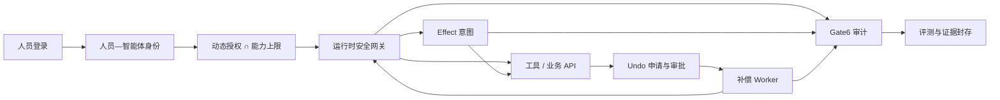
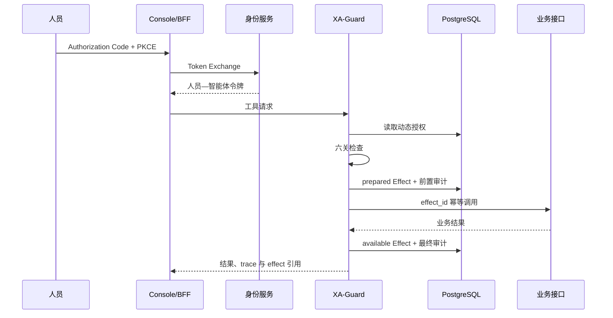
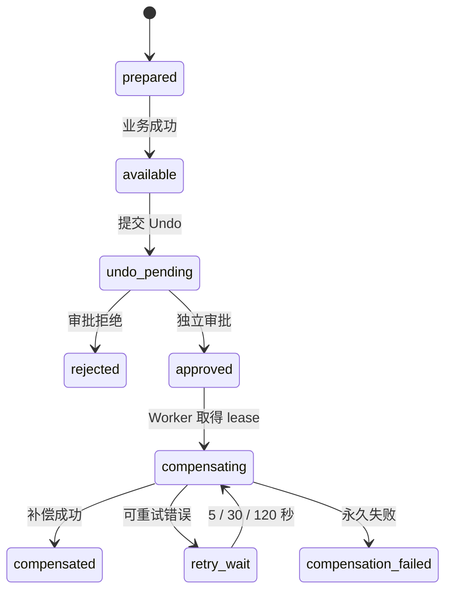
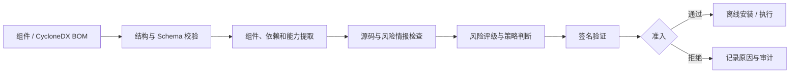

# XA-Guard：面向政企智能体的运行时安全治理与可验证恢复

题目编号：XA-202620
文档版本：v0.2-review（讨论稿）
日期：2026-07-22

## 摘要

大模型智能体已经能够读取网页和文档、检索知识库、调用脚本与接口，并直接改变业务系统状态。
在政企场景中，安全问题因而不再局限于生成内容是否合规，还包括人员委托、智能体权限、工具执行、
数据流向、第三方组件以及错误操作后的业务恢复。

XA-Guard 是部署在智能体与工具之间的运行时安全网关。系统通过人员—智能体双主体身份建立可信委托关系，
由六道安全关卡检查输入、审批、策略、信息流、执行环境和审计；对产生业务副作用的写操作，
系统先持久化 Effect 意图，再调用下游，并在独立审批后由 Worker 执行补偿。插件、Skill 和脚本
在安装或执行前经过 AIBOM 准入检查。配套的 Open Agent Range（OAR）以真实工具调用、业务后果、
哈希账本和审计回放评价防护效果。

项目已经形成由身份服务、安全网关、PostgreSQL、业务接口、补偿 Worker、Console/BFF 和评测靶场
组成的完整原型。在 OAR 同一攻击任务的本地 live A/B 中，未部署防护的一侧 3/3 发生合成数据泄漏，
XA-Guard 侧 3/3 阻断，保护侧基础设施错误为 0；full-day 场景完成 41 次工具尝试并产生 43 条
账本记录，未出现账本违规，7/7 次回放通过。最终候选的 11 个故障场景全部通过。本地三节点
Kubernetes 环境完成安装、升级、迁移重跑、服务接管、网络策略验证和回滚。10 并发正式性能实验中，
三轮 500 次成对写入的新增开销 p95 为 45.109、42.141 和 43.934ms，对应单侧 95% bootstrap
上界为 46.984、43.120 和 45.528ms。10 次 Undo 均在约 0.45–0.94s 内完成。

这些结果表明，智能体安全可以从单点输入检测扩展为覆盖身份、执行、副作用和证据的工程体系，
并在保留审计与一致性约束的条件下满足交互式业务的时延要求。

**关键词：** 智能体安全；运行时治理；MCP；身份授权；工具调用；AIBOM；可验证恢复；审计溯源

---

## 1. 问题与场景

### 1.1 智能体改变了安全边界

传统问答系统主要输出文本。智能体则会把自然语言目标转换为一系列操作：读取文件、访问网页、
调用数据库、执行命令、发送消息或修改业务记录。模型的判断一旦连接到真实工具，错误的影响就会从
“回答不准确”扩大为越权访问、数据外泄和业务状态破坏。

这种风险通常沿着数据和工具链传播。恶意指令可能隐藏在网页、附件、知识库或历史记忆中，
被模型当作任务上下文读取；模型随后选择一个原本合法的工具，并在合法参数外观下执行有害操作。
第三方插件还可能改变工具描述、引入远程下载或增加隐蔽网络能力。一次攻击会沿组件链逐步形成业务动作，
最终落到真实数据和系统状态上。


AgentDojo 和 InjecAgent 的研究说明，间接提示注入能够通过外部数据影响工具型智能体的行为[1-2]。
CaMeL 从控制流与数据流分离的角度提出系统级防护思路[3]，IsolateGPT 则强调第三方组件和执行环境之间
的隔离[4]。这些工作共同表明，输入分类、能力约束、信息流和执行隔离需要协同工作。

### 1.2 政企系统需要回答的五个问题

政企智能体通常连接组织账号、内部数据和正式业务流程。一个可落地的安全系统至少要回答：

- 哪个人正在委托哪个智能体执行任务；
- 该智能体在当前租户和业务域内具有什么权限；
- 输入、计划和工具参数是否触发安全规则或审批；
- 写操作造成的业务副作用是否能够受控恢复；
- 身份、决策、审批、执行和恢复记录能否相互验证。

可信委托需要同时保留人员和智能体身份；即时撤权和数据域边界需要动态授权关系；
真实业务状态的恢复需要执行前保存恢复合同。XA-Guard 将这些约束放在同一条请求链中。

### 1.3 典型应用

本方案选择四类场景作为主要落点：

1. **政务办公助手**：读取公文、处理邮件、发起流程，对敏感外发和高风险写入进行控制；
2. **知识服务**：接入网页、附件和知识库，识别外部内容对后续工具调用的影响；
3. **业务流程办理**：让智能体提交工单或更新业务记录，并保留审批与恢复能力；
4. **运维协同**：调用命令、文件和网络工具，通过策略与隔离环境控制影响范围。

---

## 2. 总体方案

### 2.1 系统定位

XA-Guard 位于智能体客户端和实际工具之间。上游既可以是支持 MCP 的客户端，也可以是通过 HTTP
接入的业务应用；下游可以是文件系统、脚本、浏览器、数据库或企业 API。网关与具体大模型解耦，
安全逻辑集中在网关中，业务系统按原有接口提供工具能力。

系统由四部分组成：

- **身份与治理控制面**：OIDC、人员—智能体身份、动态授权关系、静态能力上限和审批；
- **运行时安全数据面**：输入识别、计划审核、策略、信息流、沙箱和审计；
- **副作用恢复面**：EffectStore、恢复合同、独立审批、补偿 Worker 和密钥管理；
- **评测与证据面**：OAR、Gate6、Effect 事件链、证据收集与独立验签。



### 2.2 一次受保护写请求

人员首先通过 Authorization Code + PKCE 登录。Confidential BFF 使用 Token Exchange 取得绑定
人员和智能体的访问令牌。XA-Guard 验证签名、受众、租户和智能体身份，读取当前授权关系，
再执行六关检查。

对于只读操作，关卡通过后直接调用工具。对于写操作，网关先在 PostgreSQL 中写入 prepared Effect
和前置审计，再用 `effect_id` 作为幂等键调用业务接口。业务成功后，系统保存加密恢复材料，
将 Effect 转为 available，并写入最终审计。整个过程的身份、授权、决策和业务引用使用同一组
trace/effect 标识关联。



### 2.3 部署组成

Reference 环境由 PostgreSQL、Keycloak、XA-Guard API、补偿 Worker、工单业务接口和
Console/BFF 组成。Helm chart 将 API、Worker、Business API 和 Console 拆分部署，
并包含 migration Job、Secret/ConfigMap 引用、NetworkPolicy、PDB、HPA 和 Ingress 配置。
同一套核心代码既服务 MCP 调用，也服务带身份和副作用合同的业务写路径。

---

## 3. 关键技术设计

### 3.1 人员—智能体双主体身份

XA-Guard 将智能体作为受人员委托的独立行动主体，在访问令牌中同时保留人员 `sub`、智能体
`act.sub/azp`、租户、受众和有效期。服务端以签名令牌中的身份为授权依据，客户端自报的 Agent
或 tenant header 不参与授权判断。

一次请求的有效权限由四部分共同决定：

```text
有效权限 =
  已验证的人员—智能体身份
  ∩ 当前有效的人员/用户组—智能体授权关系
  ∩ 智能体静态能力上限
  ∩ 工具、数据域和参数策略
```

动态授权关系保存在 PostgreSQL 中，每次请求重新匹配。撤销某个人与智能体之间的关系后，
下一次调用立即失去权限，不需要等待旧令牌过期。静态 YAML ceiling 是不可突破的能力上限，
管理员只能在上限内授权。

这一设计使用 RFC 7636 的 PKCE 保护登录流程[5]，通过 RFC 8693 Token Exchange 的 subject/actor
语义表示委托[6]，并遵循 OAuth 安全最佳实践中的受众校验和最小权限原则[7]。MCP HTTP 授权规范
同样要求访问令牌绑定目标资源，并禁止把上游令牌原样透传给下游[8]。

### 3.2 六关运行时控制

六关共同组成一次工具调用的固定处理顺序。

| 关卡 | 处理对象 | 主要工作 |
|---|---|---|
| Gate1 输入安全 | 用户输入、网页、文档、检索与工具输出 | 规范化、来源风险、规则/模型融合、Spotlighting |
| Gate2 计划与审批 | 工具、参数和副作用等级 | 风险分级、pending、审批摘要绑定 |
| Gate3 策略 | 身份、工具、数据域和参数 | baseline/overlay 合并、谓词检查、默认拒绝 |
| Gate4 信息流 | 来源标签、敏感字段和外发目标 | 入向标签、出向 DLP、敏感流向控制 |
| Gate5 执行约束 | 文件、命令、网络和资源 | 执行 profile、只读根、非 root、资源与网络限制 |
| Gate6 审计证据 | 身份、决策、审批、结果和 trace | 规范化记录、前驱 hash、签名和完整性检查 |

Gate1 对明确攻击直接短路。Gate2、Gate4 入向检查和 Gate3 在执行前汇总决策，策略拒绝优先于审批；
通过审批后仍需执行 Gate5。工具返回结果后，Gate4 再检查出向数据，Gate6 保存最终记录。
这套顺序避免把审批按钮变成绕过策略的通道，也避免沙箱替代业务授权。

Gate1 的 Detector 接口允许组合规则检测与模型后端；Gate3 使用不可弱化的 baseline 和企业 overlay；
Gate4 把数据来源与敏感度带入后续工具调用；Gate5 根据能力选择执行环境。各关卡的命中规则、
风险标签和最终决策统一进入 Gate6。

### 3.3 双层策略与决策约束

政企组织既需要统一底线，也需要部门和业务域差异。XA-Guard 将策略分为 baseline 与 overlay。
baseline 定义全局禁止项和智能体能力上限；overlay 可以收紧工具、数据域或参数条件，
其约束范围始终位于 baseline 以内。合并结果带有 bundle hash，便于在审计中定位实际生效的策略版本。

参数谓词采用受限表达式和 AST 白名单。无法解析、字段缺失或策略后端异常时，写路径按照失败关闭处理。
策略还可以导出为 OPA/Rego bundle，用于与外部策略执行环境做一致性检查。

### 3.4 intent-first Effect 与可验证 Undo

审计记录负责说明发生过什么，Effect 负责保存恢复业务状态所需的上下文。XA-Guard 把每次写操作建模为 Effect，
其中包含人员、智能体、工具、数据域、原始 trace、幂等键、恢复窗口、合同摘要和当前状态。

写入顺序固定为：

1. 创建 prepared Effect 和 execution lease；
2. 提交前置 Gate6 记录；
3. 使用 `effect_id` 调用下游业务接口；
4. 加密保存恢复材料和合同快照；
5. 将 Effect 更新为 available，并提交最终 Gate6 记录。

如果服务在业务成功后、返回结果前崩溃，reconciler 根据 prepared intent 和 `effect_id` 查询下游，
恢复 Effect 状态。Undo 由原操作人员发起，另一名具有审批角色的人员批准。批准只创建持久化任务，
补偿由独立 Worker 执行。



Worker 使用 60 秒 lease 和 20 秒 heartbeat。持有 lease 的 Worker 失效后，其他实例在 lease 到期后
接管。网络超时、429 和 5xx 按合同持久化重试；参数、签名和策略错误直接失败。
补偿动作使用内部签名授权，并重新经过动态授权、Governance 和六关。调度语义采用至少一次投递，
下游以 `effect_id` 提供幂等执行。

恢复材料由随机 DEK 加密，DEK 使用版本化 KEK 包裹。Keyring 同时支持当前写入 key 和历史解密 key，
并能够在线 rewrap。错误 KEK 会阻止补偿任务继续执行。

### 3.5 AIBOM 供应链准入

插件、Skill 和脚本可能通过源码、依赖、远程下载、隐蔽外联或能力声明引入风险。AIBOM gateway
在组件安装和执行之前完成准入：



系统支持内部组件描述和 CycloneDX 1.6 BOM，提取组件、依赖、MCP/AI 能力、漏洞与风险指标，
生成 A–F 评级并验证签名。离线安装路径检查路径穿越、危险隐藏文件和能力声明不一致。
CycloneDX 的组件、依赖、服务、漏洞和 provenance 模型为 AIBOM 的交换格式提供了基础[9]。

### 3.6 Gate6 与证据链

Gate6 记录人员、智能体、租户、工具、参数摘要、策略、审批、风险、结果摘要、trace 和前驱 hash。
Effect 事件链保存 prepared、available、undo_requested、approved、compensation_started 和
compensated 等状态。两条链通过 `trace_id`、`effect_id` 和业务引用交叉关联。

证据收集器从 PostgreSQL 读取链记录和业务状态，重新计算 hash，检查链间引用和验收断言，
再对 artifact manifest 进行 SM2-with-SM3 签名。公开证据只包含审计投影和摘要，
访问令牌、恢复材料和私钥保留在运行环境。

---

## 4. 工程化实现与优势

### 4.1 从安全模块到完整业务闭环

XA-Guard 的 Reference 路径运行完整跨服务链路：

```text
Keycloak 登录
  → PKCE 与 Token Exchange
  → 人员—智能体身份
  → PostgreSQL 动态授权
  → 六关运行时决策
  → prepared Effect
  → 有状态业务接口
  → 独立 Undo 审批
  → Worker 补偿
  → Effect/Gate6 双链
  → 签名 evidence
```

Console/BFF 为 Alice、Dora 和管理员提供独立会话。Alice 创建工单并申请 Undo；审批权限由 Dora 的
独立会话持有；Worker 随后调用取消工具。管理员负责授权关系和失败任务处置。前端角色、后端令牌、
数据库 assignment 和审批权限使用同一身份来源，身份隔离一直延伸到后端授权判断。

### 4.2 数据一致性与并发写路径

Effect 和 Gate6 都是同租户有序 hash 链。并发请求如果分别竞争连接、事务和链锁，既会增加尾延迟，
也可能在错误实现中产生旧链尾。当前实现采用三层约束：

1. 同租户请求先在进程内排队，避免等待链锁的任务提前占满连接池；
2. PostgreSQL advisory lock 提供跨进程和跨副本互斥；
3. `xa_chain_tails` 记录期望链尾，Effect/Gate6 按固定顺序锁定并执行 CAS。

prepared/final 请求进入统一按租户调度器。混合批次仍保持 final→prepared 顺序，
但可以复用同一连接和事务；Gate6 使用有序数组输入，Effect completion 使用批量更新。
JSON/JSONB 使用紧凑 UTF-8 codec，Gate6 大记录保持 PostgreSQL EXTENDED 存储并启用 LZ4。

这些优化保留了 `fsync`、`synchronous_commit`、`full_page_writes` 和响应前审计持久化。
性能结果覆盖完整安全语义及数据库可靠性设置下的写路径。

### 4.3 故障恢复设计

工程验证覆盖了多个真实故障窗口：

- PostgreSQL 在写请求前中断，业务接口没有收到调用；
- API 在业务成功后崩溃，reconciler 依据 prepared Effect 恢复；
- 两个审批请求并发到达，只生成一个补偿任务；
- 持有 lease 的 Worker 被终止，另一实例接管；
- 下游连续返回 429、5xx 和超时，任务按 5/30/120 秒执行持久化重试；
- 错误 KEK 阻止解密，管理员恢复正确 key 后重新调度；
- 新 KEK 上线后完成在线 rewrap，历史记录仍可恢复。

故障恢复依托持久化状态和幂等业务接口，能够跨进程、跨实例继续推进。

### 4.4 部署、升级与回滚

Reference Compose 用于本地完整闭环；Helm chart 面向外部 OIDC、PostgreSQL 和 key provider。
Chart 将 migration 作为独立 Job，API 和 Worker 支持多副本，并提供滚动升级、PDB、HPA、
NetworkPolicy 和 Secret 引用。

本地三节点 kind 验证从旧版镜像安装开始，随后升级到当前候选，并实际执行：

- migration 重跑；
- API Pod 删除与请求恢复；
- prepared Effect 接管；
- Worker lease 接管；
- NetworkPolicy 正向/负向探针；
- Helm rollback。

验证过程同时覆盖服务启动、数据迁移、业务请求和故障注入。

### 4.5 质量与发布验证

项目把单元测试、集成测试、部署检查、前端构建和证据验签收敛到统一 verifier。最终候选在隔离 Python
环境中完成依赖一致性检查、产品 Ruff、全仓 pytest、L3 static、Compose config、Console 测试与构建，
以及最终 evidence verifier。发布 manifest 只允许在干净工作树上生成，并绑定 commit、分支、
文件大小和 SHA-256。

依赖使用仓库许可证和第三方清单管理。运行密码、client secret、KEK、内部签名 key、KMS token 和
DSN 仅保存在 gitignored 运行目录，并通过 Secret 挂载；公开证据只保留验证所需的审计投影和摘要。

### 4.6 工程验证结果

| 工程面 | 验证规模 | 结果 |
|---|---:|---|
| 自动质量矩阵 | 782 collected | 781 passed，1 个 Windows 能力 skip，0 failure/error |
| Reference 故障 | 11 个场景 | 11/11 PASS |
| 正式写路径性能 | 10 并发，3×500 paired writes | 三轮 p95 与 bootstrap upper 均低于 50ms |
| Undo | 10 次真实业务取消 | 10/10，约 0.45–0.94s |
| 本地集群 | 三节点 kind | 安装、升级、迁移、接管、网络策略和回滚通过 |
| 最终证据 | 14 artifacts | 102 Effect、59 Gate6，SM2-with-SM3 独立验签通过 |
| Console | 三个独立账号会话 | 创建、申请、审批、补偿与证据时间线完成 |

工程化优势不只体现在测试数量，而是同一组身份、事务、故障和证据约束贯穿接口、数据库、Worker、
部署和前端。故障报告、性能报告与最终证据包绑定到同一候选，减少了“功能演示通过但交付版本不同”
的口径漂移。

---

## 5. 实验设计与结果

### 5.1 Open Agent Range

OAR 是面向企业任务链的红队评测环境。它包含人员、智能体、工具面、数据域、业务状态、攻击 finding、
attempt ledger 和 replay。与只判断一句输入是否恶意相比，OAR 关注攻击是否真正触发工具、
是否改变业务后果，以及网关审计能否与靶场账本对齐。

OAR 设计了三类实验：

- **full-day**：在多个业务域中运行连续任务，观察工具尝试、账本和违规；
- **live A/B**：同一 finding 分别运行在 Null 和真实 XA-Guard MCP session；
- **replay**：验证 artifact hash、ledger 投影、工具事件和原始 SUT 审计。

live A/B 每侧独立重复 3 次。保护效果按两侧泄漏率之差计算，基础设施错误单独记录。
这可以区分“安全网关主动阻断”和“服务没有正常运行”。

### 5.2 OAR 结果

| 指标 | Null | XA-Guard |
|---|---:|---:|
| 独立 attempts | 3 | 3 |
| 合成数据泄漏 | 3 | 0 |
| 保护侧基础设施错误 | — | 0 |
| 泄漏率 | 1.0 | 0.0 |
| protection delta | — | 1.0 |

full-day 场景完成 41 次工具尝试，产生 43 条 ledger 记录，ledger violation 为 0。
7/7 次 attempt replay 均通过。XA-Guard 侧的工具事件、range audit、ledger 和原始 Gate6 记录
可以逐序对齐。

### 5.3 故障实验

Reference all-fault 将身份拒绝、授权撤销、租户隔离、数据库中断、API 崩溃恢复、并发审批、
Worker 接管、持久化重试、错误 KEK、密钥轮换和历史记录恢复组合为 11 个场景，最终结果为 11/11。

故障实验同时检查业务有效副作用数量。例如并发审批和 Worker 重试可以产生多次调度尝试，
但业务接口只能观察到一次有效取消。这使测试结果同时覆盖控制面状态和实际业务后果。

### 5.4 性能实验

每个性能样本由一次 XA-Guard 受保护写和一次直接业务写组成。AB/BA 顺序平衡并打乱，
新增开销定义为：

```text
incremental_latency =
    protected_write_latency - direct_business_write_latency
```

实验使用 10 并发，每轮 30 次 warmup 和 500 次 measured pairs。除增量 p95 外，
还通过 5000 次非参数 bootstrap 计算单侧 95% p95 上界。三轮结果如下：

| seed | incremental p95 | 单侧 95% bootstrap upper |
|---:|---:|---:|
| 20260741 | 45.109ms | 46.984ms |
| 20365470 | 42.141ms | 43.120ms |
| 20470199 | 43.934ms | 45.528ms |

三轮点估计与上界均低于 50ms。相同实验中完成 10 次 Undo，批准到业务取消约为 0.45–0.94s。

### 5.5 代表性攻击链与业务后果验证

在 OAR 主评测之外，本文从赛题四个方向选取六类代表性攻击链，固化为可复现证明集
（`xa-attack-proof-set-v1`）。证明集关注攻击是否跨越安全边界、是否触发下游动作以及业务状态是否改变，
而不是仅判断一段输入是否包含恶意文本。每类攻击保留独立业务判据，不把异构指标合并成单一攻击成功率。

以邮箱间接提示注入为例展开一条完整链：攻击内容随一封普通邮件进入邮箱场景；
Gullible seat 读取邮件后把注入指令当作任务的一部分；Null 侧发起对外发送，
合成市民数据 `cit-1001` 被发往外部甲方；同一 finding 在 XA-Guard 侧运行时，
网关在工具执行前裁决为 deny，下游外发为 0，Gate6 记录与靶场 ledger、replay 结果逐序对齐。
两侧各独立重复 3 次，结果一致。

最终证明运行 `xa-attack-proof-v1-20260726T125940Z-win-local` 在 clean checkout 上完成，
运行起止 Git HEAD 均为 `db97de856a88b95a4272874d5ee39bb05bcd40fb`，工作树均无未提交修改。
封存包 SHA-256 为 `57a388568aac729304585fe94966a2143df5fd6c68c4d12978618ad098834cf4`；
根清单覆盖除自身外的 240/240 个文件，并包含 OAR 的 12 个子 hash 清单。

六类 case 的对照与业务观测如下：

| 赛题映射 | 代表性攻击链 | 对照设计 | 已观察业务结果 |
|---|---|---|---|
| 方向一：复杂输入链路 | 邮箱间接提示注入外发 | Null / XA-Guard live 各 3 次 | Null 泄漏 3/3；保护侧泄漏 0/3，infra error 0；3/3 protected replay 的 hash、ledger、SUT/原始 Gate6 对齐通过 |
| 方向一：复杂输入链路 | RAG 间接提示注入外发 | Null / XA-Guard live 各 3 次 | Null 泄漏 3/3；保护侧泄漏 0/3，infra error 0；3/3 protected replay 的 hash、ledger、SUT/原始 Gate6 对齐通过 |
| 方向二：工具与任务执行 | 未经批准的高风险命令 | Null、拒绝、批准三路 | Null 下游 1；拒绝下游 0，审计 require_approval → deny；批准对照下游 1，审计 require_approval → allow |
| 方向三：供应链安全 | 恶意插件准入 | 恶意 code snippet 与本地干净 artifact | 恶意插件 deny、下游 0；干净 artifact 经批准后 require_approval → allow、下游 1 |
| 方向四：评测与审计 | Gate6 审计副本篡改 | clean 与 tampered 副本 | clean 验签通过，tampered 验签失败，原始 audit hash 不变 |
| 横向身份边界 | 伪造 header、撤权与跨租户隔离 | 独立验签最终 identity evidence bundle | verifier 通过；14 artifacts / 102 Effect / 59 Gate6，三个身份 subcase 均满足预设判据 |

该证明集是合成确定性场景：OAR live A/B 每类 N=3，只说明本场景结果，不外推为泛化攻击率；
MCP 下游为只记账的安全合成 target，不执行命令、插件或网络动作；身份边界 case
复用独立验签的最终 evidence bundle，不重跑长故障套件。公开复现材料由脱敏 case manifest、
评测 runner、结果摘要、源码 provenance 和文件 hash 组成，见
`docs/evidence/attack-proof-set-2026-07-26.md`。D1 正文不复制原始注入 payload、危险命令、插件攻击代码、
原始审计记录、审批令牌或运行环境绝对路径，避免把攻击文本的新颖性误写成系统防护能力。

### 5.6 证据完整性

最终 evidence 从同一候选环境采集，包含身份、assignment、业务对象、Undo 请求、Effect 链、
Gate6 链和三份验收报告。Collector 执行 secret scan、hash 重算、链间引用检查和业务状态断言，
随后生成签名 manifest。独立 verifier 固定 public key id 并验证 14 个 artifacts、
102 条 Effect 和 59 条 Gate6 记录。

---

## 6. 政企应用价值

### 6.1 对业务系统的接入方式

XA-Guard 采用网关方式接入。支持 MCP 的客户端可以把工具调用先发送到 XA-Guard；
传统业务应用可以使用 Control API。模型、客户端和业务接口之间保持松耦合，
安全策略、审批和证据由网关集中处理。

动态授权关系适合组织中的“人员—数字员工—数据域”管理。人员离岗、岗位变化或智能体能力调整时，
管理员修改 assignment 即可生效。YAML ceiling 保留平台级安全底线，业务部门的 overlay
负责表达部门和场景差异。

### 6.2 对安全与审计工作的价值

安全团队能够从同一条记录中看到人员、智能体、工具、数据域、策略版本、审批人、业务引用和结果。
Effect 把审计与恢复连接起来：审计人员不仅能定位异常写操作，还能看到可逆性、恢复窗口、
补偿状态和失败原因。

OAR 提供从攻击任务到业务后果的可重复验证方法。策略调整后可以重跑相同 finding 和 replay，
比较保护效果及审计变化，从而形成评测、修复和复验闭环。

### 6.3 与合规和治理要求的衔接

GB/T 45654-2025 对生成式人工智能服务的安全要求、GB/T 22239-2019 的身份鉴别与安全审计、
GB/T 39786-2021 的密码应用要求，为政企智能体治理提供了基础规范[10-12]。
《人工智能安全治理框架》2.0 强调风险分类、全生命周期治理和技管结合[13]。
OWASP 针对 LLM 与 Agentic Application 总结了提示注入、过度代理、工具滥用和身份权限等风险[14-15]；
NIST AI 600-1 则从治理、测量和风险管理角度给出生成式人工智能的组织级实践框架[16]。

XA-Guard 中的身份验证、最小权限、运行时控制、审批、密码完整性、评测和恢复机制可以为组织落实
相关要求提供技术支撑。实际部署时，仍需结合组织制度、目标系统定级、密码应用方案和正式测评流程。

---

## 7. 结论

XA-Guard 将智能体安全从输入过滤扩展到完整行动链。人员—智能体双主体身份解决可信委托问题；
六关网关在工具执行前后统一处理输入、审批、策略、信息流、隔离和审计；intent-first Effect
把副作用恢复所需的信息提前到执行之前；AIBOM 控制扩展组件入口；OAR 和签名 evidence
用于验证防护结果与审计完整性。

项目已经完成跨身份服务、网关、数据库、业务接口、Worker、Console 和评测环境的工程闭环。
最终候选通过故障、并发性能、本地集群和统一质量验证，并保留可独立验签的证据包。

本文实验基于 Reference Compose 和本地三节点 kind 环境，结论适用于当前实现、场景与恢复合同。
进入组织生产环境还需要完成目标 IdP、TLS、托管数据库、正式 KMS/HSM、备份、监控和容量验证。

---

## 参考文献

[1] Debenedetti E, Zhang J, Balunović M, et al. AgentDojo: A Dynamic Environment to Evaluate
Prompt Injection Attacks and Defenses for LLM Agents[C]//Advances in Neural Information Processing
Systems. 2024. <https://proceedings.neurips.cc/paper_files/paper/2024/hash/97091a5177d8dc64b1da8bf3e1f6fb54-Abstract-Datasets_and_Benchmarks_Track.html>

[2] Zhan Q, Liang Z, Ying Z, et al. InjecAgent: Benchmarking Indirect Prompt Injections in
Tool-Integrated Large Language Model Agents[C]//Findings of the Association for Computational
Linguistics: ACL 2024. 2024: 10471-10506. <https://aclanthology.org/2024.findings-acl.624/>

[3] Debenedetti E, Shumailov I, Fan T, et al. Defeating Prompt Injections by Design[EB/OL].
arXiv:2503.18813, 2025. <https://arxiv.org/abs/2503.18813>

[4] Wu Y, Roesner F, Kohno T, et al. IsolateGPT: An Execution Isolation Architecture for
LLM-Based Agentic Systems[C]//Network and Distributed System Security Symposium. 2025.
<https://doi.org/10.14722/ndss.2025.241131>

[5] Sakimura N, Bradley J, Agarwal N. RFC 7636: Proof Key for Code Exchange by OAuth Public
Clients[S]. IETF, 2015. <https://www.rfc-editor.org/rfc/rfc7636>

[6] Jones M, Nadalin A, Campbell B, et al. RFC 8693: OAuth 2.0 Token Exchange[S]. IETF, 2020.
<https://www.rfc-editor.org/rfc/rfc8693>

[7] Lodderstedt T, Bradley J, Labunets A, et al. RFC 9700: Best Current Practice for OAuth 2.0
Security[S]. IETF, 2025. <https://www.rfc-editor.org/rfc/rfc9700>

[8] Model Context Protocol. Authorization Specification, Version 2025-11-25[EB/OL]. 2025.
<https://modelcontextprotocol.io/specification/2025-11-25/basic/authorization>

[9] Ecma International. ECMA-424: CycloneDX Bill of Materials Standard, 1st Edition[S]. 2024.
<https://ecma-international.org/publications-and-standards/standards/ecma-424/>

[10] 国家市场监督管理总局, 国家标准化管理委员会. GB/T 45654-2025 网络安全技术
生成式人工智能服务安全基本要求[S]. 2025.

[11] 国家市场监督管理总局, 国家标准化管理委员会. GB/T 22239-2019 信息安全技术
网络安全等级保护基本要求[S]. 2019.

[12] 国家市场监督管理总局, 国家标准化管理委员会. GB/T 39786-2021 信息安全技术
信息系统密码应用基本要求[S]. 2021.

[13] 全国网络安全标准化技术委员会. 人工智能安全治理框架 2.0[R]. 2025.

[14] OWASP GenAI Security Project. OWASP Top 10 for LLM Applications 2025[R]. 2025.
<https://genai.owasp.org/llm-top-10/>

[15] OWASP GenAI Security Project. OWASP Top 10 for Agentic Applications 2026[R]. 2025.
<https://genai.owasp.org/resource/owasp-top-10-for-agentic-applications-for-2026/>

[16] Autio C, Schwartz R, Dunietz J, et al. Artificial Intelligence Risk Management Framework:
Generative Artificial Intelligence Profile, NIST AI 600-1[R]. National Institute of Standards
and Technology, 2024. <https://doi.org/10.6028/NIST.AI.600-1>

---

## 附录 A：验证材料索引

本附录单列本文结果对应的仓库验证记录，与学术论文、协议和标准分开。

| 验证内容 | 材料位置 |
|---|---|
| OAR full-day、live A/B 与 replay | `docs/acceptance/EVIDENCE-CONSOLIDATION.md` §2 |
| Reference 11/11 fault | `docs/evidence/agent-identity-undo-final-2026-07-21/acceptance/reference-faults-all-final-rerun-20260721.json` |
| 本地三节点 kind | `docs/evidence/agent-identity-undo-final-2026-07-21/acceptance/kind-ha-final-pass-20260721.json` |
| 正式 3×500 性能与 Undo | `docs/evidence/agent-identity-undo-final-2026-07-21/acceptance/perf-formal-mixed-transaction-rebuilt-20260721.json` |
| 最终签名 evidence | `docs/evidence/agent-identity-undo-final-2026-07-21.md` |
| 代表性攻击链的脱敏清单、脚本、结果摘要、源码 provenance 与 hash | `docs/evidence/attack-proof-set-2026-07-26.md` |
| 三账号 Console 闭环 | `docs/evidence/mcp-live-acceptance-2026-07-19/` |
| 最终仓库状态与统一验证 | `status.md` |
